### Object classes

Stanford drone dataset has next object classes: pedestrians, bikers, skateboarders, cars, buses, and golf carts. For
drone navigation task it would be useful to reduce number of classes by following rules:
pedestrians, skateboarders -> person; bikers -> bicycle; buses, cars and golf carts -> cars, because this aggregated
classes represents objects of the similar physical dimensions and moving behavior, what is important for drone
navigation planning.

So now we have 3 classes: persons, bicycles and cars.

### Train/val splits

I suggest splitting dataset in train/val in following way:

* In every scene bring one video to val split;
* Also bring to val one whole scene because dataset itself has low number of scenes, so we need to check model on completely unseen data.

### Stanford dataset analysis

Provided in stanford_dataset_overview.ipynb

### Segmentation approaches

Cause stanford drone dataset has no segmentation annotation we need either to create Unsupervised segmentation
annotation for learning/inference purposes or apply pretrained on similar dataset model to our data.

Overall I think the following segmentation approaches are worth to be considered:

1. <b>Unsupervised segmentation based on background image. </b>
   Having background image for each clip it is easy to get segmentation by subtraction of frames and background, class
   assignment could be done with help of bounding boxes classes. If camera position was static, it would be possible to
   get background images by aggregation of areas not get into bounding boxes. But in most videos we can see serious
   fluctuations of camera due to wind, so it is impossible to get clear background image by simple aggregation of video
   frames. In such case warping several frames with help of optical flow could be useful for background estimation.

2. <b>Unsupervised segmentation based on CNNs and classical methods like Super Pixel, GrabCut and other. </b>
   There are some Unsupervised CNN approaches (https://paperswithcode.com/task/unsupervised-semantic-segmentation),
   Semi-supervised (https://paperswithcode.com/task/semi-supervised-semantic-segmentation) and Weakly
   supervised (https://paperswithcode.com/task/weakly-supervised-semantic-segmentation
   , https://www.youtube.com/watch?v=jM1T1HwbY5s&ab_channel=RodrigoBenenson). These methods needs deeper investigation
   and time for experiments. Also due to weak untight bounding box labeling they could perform not well. E.g. this
   method (https://josephkj.in/projects/MASON/) uses GrabCut and CNN features for weakly supervised segmentation and
   result is not very beautiful (https://www.youtube.com/watch?v=GG_Pr8hdZhY&t=26s&ab_channel=JosephKJ
   ).

3. <b>Pretraining on other dataset.</b>
   Similar datasets overview provided in similar_datasets_overview.ipynb. The most suitable datasets are marked with
   the `Good` tag. Despite there's some number of similar datasets all of them rather small and none of them has 'biker'
   class.

1st and 2nd approaches could be used either for annotation training data or for direct inference. There is one important
drawback of these two approaches - they suffer much from strong shadows which could be considered as segmented area.
Also in case of usage retrieved segmentations as training data it is needed to implement segmentation model as like for
approach #3.

### Approaches implementation

1. <b>Unsupervised segmentation based on background image. </b>

* Vanilla background based segmentation. For every frame we create individual background image due to unstable drone
  position. For every detection (GT bbox) we find the closest frame which doesn't contain overlapping bounding boxes
  with ours, after that we simply replace bbox area in our frame with same one area from found frame. Implementation you
  can find in vanilla_background_based_segmentation.ipynb and in vanilla_background.py Segmentation results stored
  at https://drive.google.com/drive/folders/1JCxWRWE3hx_6iZH-kOFXEYWnDmV73S_K?usp=sharing (segmentation based on GT
  bboxes; classes are not presented)
  Pros and cons of the approach: unsupervised, rather fast, low resources consumption, in spite of this there are
  several drawbacks, e.g. only detected (by detector) ever moved objects could be segmented, all shadows in bounding box
  get into segmentation, shadows not get into bbox from previous frames can also corrupt current segmentation,
  segmentation sometimes rather poor due to low contrast.
* Approach based on optical flow. For every frame we estimate several optical flows from this frame to a bunch of other
  frames at different distance ([-8,-4,-2,-1,1,2,3,4,8]). Then we aggregate magnitude of this optical flows in one
  segmentation mask, only crops under bbox of which are used cause in other places there could be movements of other
  objects like trees or just drone instability. Implementation you can find in opt_flow_background.py Segmentation
  results stored at https://drive.google.com/drive/folders/1qojNzP26oMT-MSoyEhOCeXC9Yd47V0rc?usp=sharing (segmentation
  based on GT bboxes; classes are not presented).
  Pros and cons of the approach: unsupervised, work better than background based approach to images with low
  contrastness; drawbacks: rather slow due to we need calculate opt flow for each frame several times, only objects in
  motion could be segmented, all shadows in bounding box get into segmentation.

2.  <b> Supervised models </b>

    2.1 Semantic Drone Dataset

    According to similar_datasets_overview.md I tried to train model on Semantic Drone
    Dataset (https://www.tugraz.at/index.php?id=22387) for 4 classes
    (person, bicycle, background, car). Tried different architectures including Unet, FCN and DeepLabV3 with resnet-50,
    mobilenet-v2 and efficientnet-b2 backbones, found that DeepLabV3 with efficientnet backbone faster and better converges
    then others. Dataset is quite small, besides these results quite normal. The most problem cases - small objects - people
    and bicycles captured from huge distance. Tried to use focal loss to Increase accuracy for such objects, but it didn't
    help. Direct applying pretrained on Semantic Drone Dataset model to Stanford Drone Dataset didn't give any result.
    Segmentation results on Semantic Drone Dataset:
    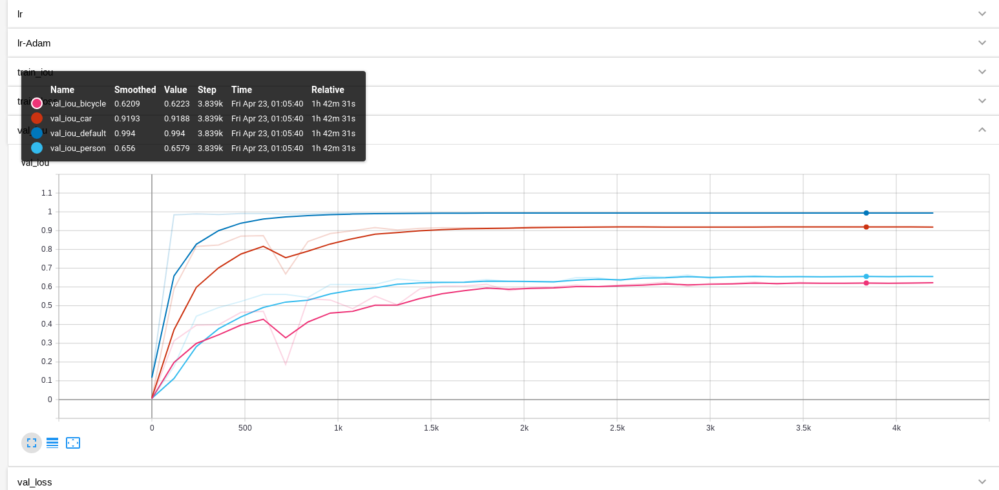
    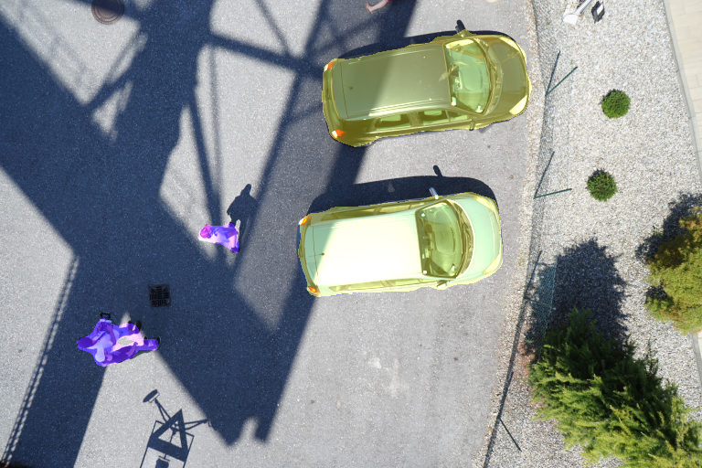
    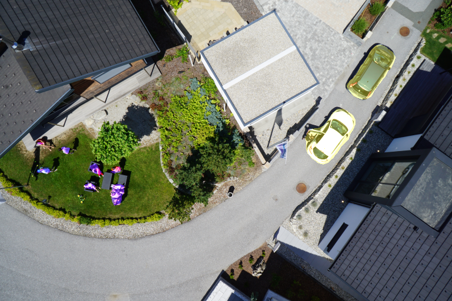
    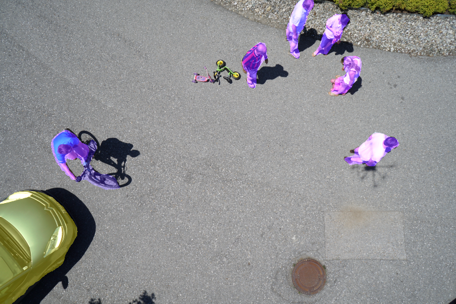
    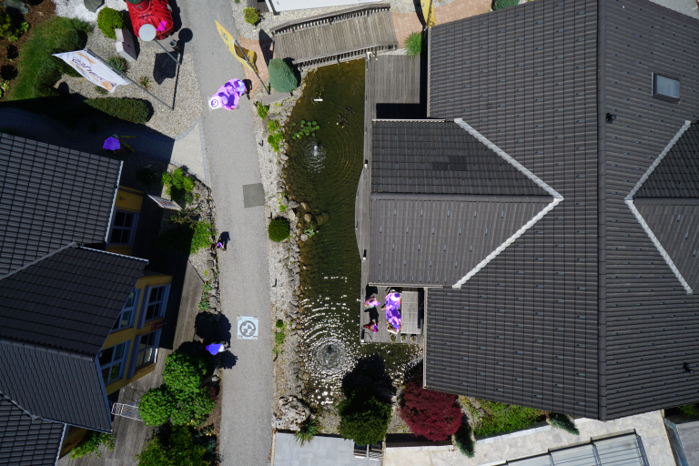
    Model weights: https://drive.google.com/drive/folders/111MWMEeYrKWLxP5lsQl5Uw7SPA4uak-1?usp=sharing
    
    2.2 <b> Stanford Drone Dataset </b>
    
    Dataset was prepared using Vanilla background segmentation because it is much faster then opt flow method. The simplest and
    quik-to-experiment model seems to look like a regular segmentation model with the ability to input multiple consecutive
    frames. Intially Deeplabv3-effnet-b2 was chosen as the regular segmentation model due to it has proven good results on
    Semantic Drone Dataset, but later the model was changed to Deeplabv3-effnet-b0 due to lightness and ability to use a
    larger batch_size and more frames in input sequence. It was tried plenty of input/output and other hyperparameters
    configurations for this model:
    
    * passing single still frame as input (3-channels input)
    * passing 3 colored consequence frames (9-channels input)
    * passing 3,5,7 grayscale consequence frames (3/5/7-channels input)
    * passing input frames in different sizes (480x480, 576x678, 512x512, 640x640)
    * using different augmentation strategies
    * passing consequence frames with different distances between them: 1,3,4,6,10,14 
    * using different classes reduction, e.g. skater reduction to a bicycle or to pedestrians or reducing car-class to
      background
    * predicting mask for single (central) frame of the input sequence or for all input frames
    * using focal loss
    * using dilate morphology function to increase non-default classes area in GT masks
    
    It is needed to say that training process was very unstable due weak annotation and small sizes of objects.
    
    The best explored configuration is:
    
    * Not to use one still image due to weak results;
    * Refuse to use the Car class because there are too few entities of this class in annotation (~1%), 
      and most cars are staying still during the whole video and not get into unsupervised segmentation. 
      So even segmented cars make only noise in Segmentation dataset;
    * Merge Skater class with Pedestrians (not with Bicyclist) because skaters usually have same velocity as pedestrians, 
      and it is very hard visually to differ them from pedestrians;
    * Using only 3 grayscale frames in one sample, no more, because it gives opportunity to use bigger batch_size and stabilize training;
    * Predicting mask only for single (central) frame;
    * Using morphology dilation gives very high gain;
    * Using higher input resolution gives much better result, so in final version it was used 640x640;
    * Using square input image crops  because dataset videos has very different aspect ratios (half of which has height>width) 
      and regular resizing gives high space deformations which leads to the fact that objects move faster in one direction in one video, but in another direction in other video. 
    * Best interframe gap for consequence frames from one sample - 10
    
Results are following:
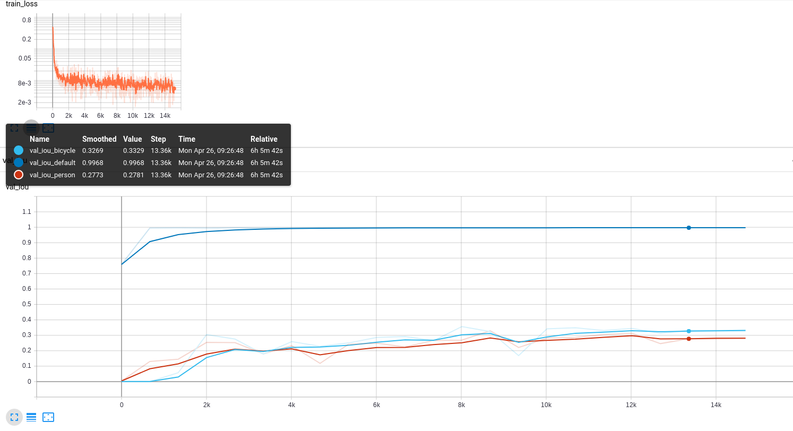
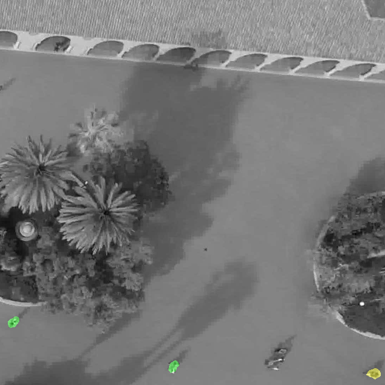
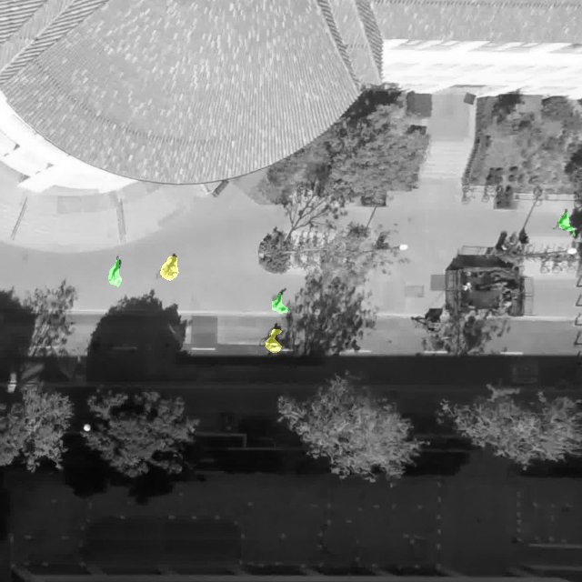
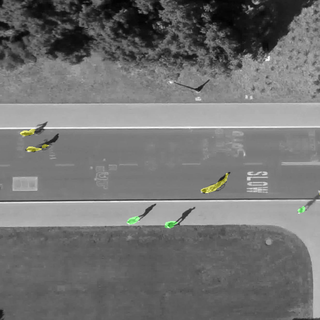
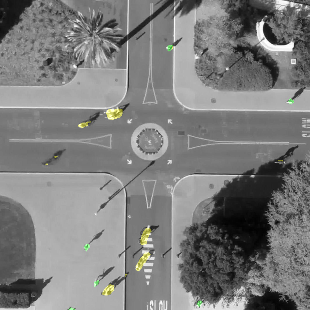
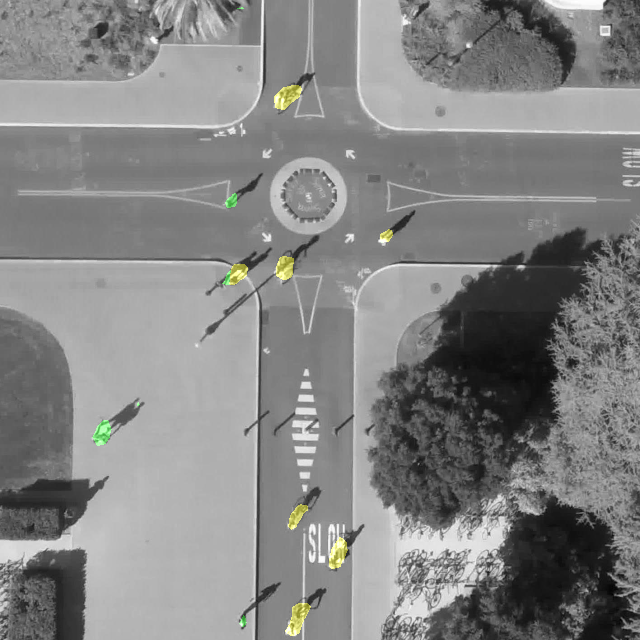
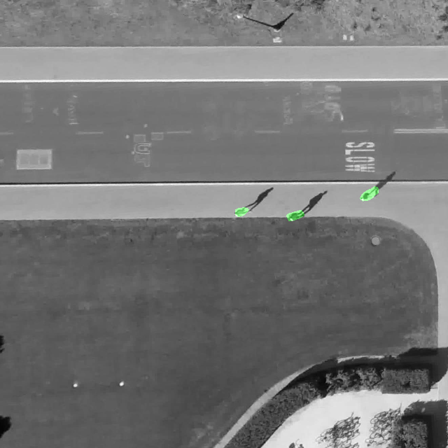
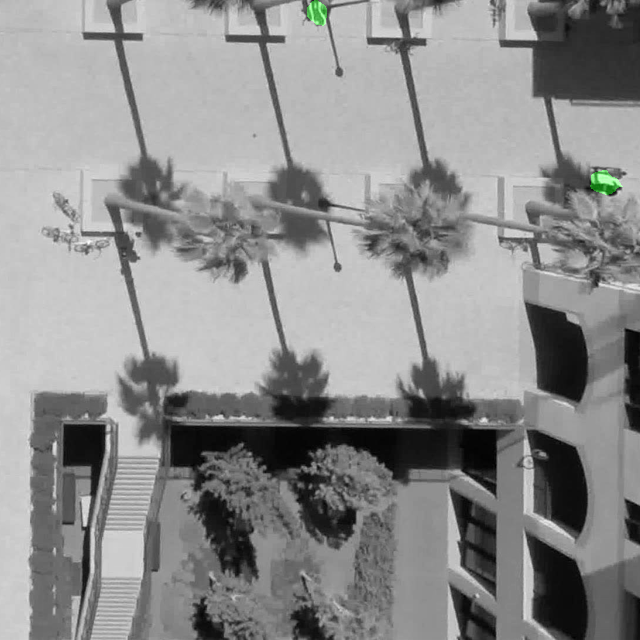
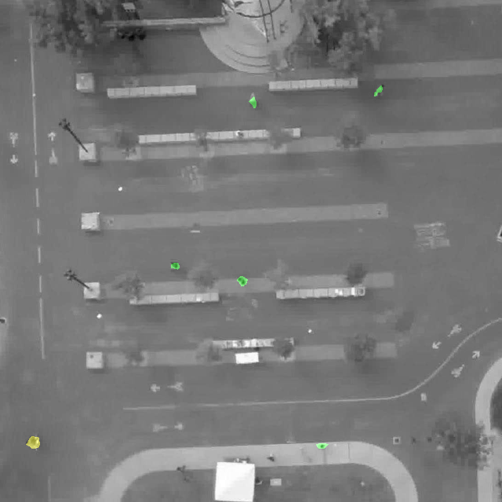
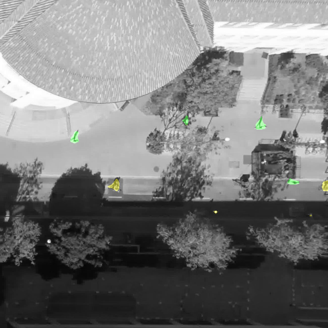

Videos of model inference on validation split you can find here (N.B. 'little' scene unseen by model at all): https://drive.google.com/drive/folders/1FL8_Gg9hcQWkvBY5nqSSw_37AjOEU5LF?usp=sharing

Model weights: https://drive.google.com/drive/folders/1UHM5eAp31jn_8Rz9FHmGQXUENNHWyNr0?usp=sharing